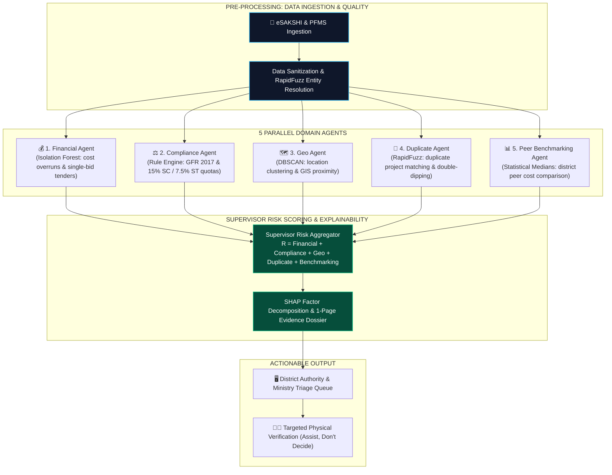

# JanNigrani MAS : Multi-Agent Intelligence Pipeline for MPLADS
### Smart India Hackathon 2026 | Problem Statement ID: **26102**
**Ministry:** Ministry of Statistics & Programme Implementation (MoSPI)  
**Department:** Data Informatics & Innovation Division (DIID)  
**Theme:** Smart Automation | **Category:** Software  
**Team:** **SentinelX3.0**  

🌐 **Live Working Prototype (Vercel):** [https://frontend-theta-six-83.vercel.app](https://frontend-theta-six-83.vercel.app)  
🌐 **Alternative Mirror (Netlify):** [https://gleaming-malasada-dafc82.netlify.app](https://gleaming-malasada-dafc82.netlify.app)  
📂 **Target Repository:** [https://github.com/incharagwda123-alt/JanNigrani-MAS](https://github.com/incharagwda123-alt/JanNigrani-MAS)

---

## 🏛️ 1. Core Architectural Maxim

> ### ⚖️ Foundational Guiding Principle
> **"This alert indicates risk and requires human investigation. It does not prove fraud."**  
> 
> *"Models and rules produce the facts; agents coordinate the analysis and explain the evidence."*

The Members of Parliament Local Area Development Scheme (MPLADS) disburses over **₹4,000 Crores annually** across 543+ constituencies to create durable public community assets.

**JanNigrani MAS** establishes an autonomous, explainable multi-agent intelligence layer that unifies disparate eSAKSHI data, computes a calibrated **0–100 Investigation Priority Score**, and generates verifiable evidence dossiers for District Collectors.

---

## 🤖 2. The 5-Agent Architecture (Matching SIH PPT Slides 3 & 4)

JanNigrani MAS employs a modular multi-agent pipeline composed of **5 Specialized Domain Agents** coordinated by the Supervisor Engine over an immutable shared state:



#### Breakdown of the 5 Domain Agents (Matching SIH PPT Slides 3 & 4):

1. **💰 Financial Agent (Isolation Forest)**
   * Detects abnormal cost overruns and inflated estimates against historical distributions.
   * Identifies single-bid tenders and sudden payment pace surges ahead of milestones.

2. **⚖️ Compliance Agent (Rule Engine)**
   * Validates General Financial Rules (GFR 2017) procurement protocols.
   * Enforces mandatory statutory allocations: **15% Scheduled Caste (SC)** and **7.5% Scheduled Tribe (ST)** quotas.
   * Flags missing Executive Engineer Measurement Book (MB) sign-offs and stale geotagged photos (>180 days).

3. **🗺️ Geo Agent (DBSCAN & Spatial GIS)**
   * Analyzes project latitude/longitude coordinates and identifies geographic inconsistencies.
   * Executes location clustering (DBSCAN) to flag contractor territory monopolies across municipal agencies.

4. **📑 Duplicate Agent (RapidFuzz Semantic Matching)**
   * Employs RapidFuzz token sorting and Sentence-BERT semantic similarity to detect duplicate work descriptions.
   * Enforces a **300m–500m proximity buffer** to prevent cross-scheme double-dipping (e.g. claiming MPLADS for roads built under PMGSY).

5. **📊 Peer Benchmarking Agent (Statistical Medians)**
   * Benchmarks individual work costs against district and sector-level historical medians.
   * Detects severe payment-progress divergences (e.g., 98% funds disbursed vs 52% physical progress).

---

## 📂 3. Repository Structure

```
JanNigrani-MAS/
├── .gitignore
├── docker-compose.yml             # Containerized full-stack deployment
├── README.md                      # Primary project documentation
│
├── frontend/                      # Executive Audit Command Center (Next.js / SPA)
│   ├── index.html                 # eSAKSHI Executive Triage Dashboard
│   ├── app.js                     # State manager, Leaflet maps, dynamic triage logic
│   ├── data.js                    # Canonical eSAKSHI sample dataset (500+ records)
│   ├── styles.css                 # Glassmorphism dark-mode government UI
│   └── package.json               # Frontend dependencies & scripts
│
├── backend/                       # Python 5-Agent Architecture & Machine Learning Layer
│   ├── main.py                    # FastAPI asynchronous REST endpoints
│   ├── Dockerfile                 # Container image specification
│   ├── requirements.txt           # Python dependencies
│   │
│   ├── schemas/                   # Pydantic v2 Type Contracts
│   │   ├── project.py             # 17-field canonical eSAKSHI schema
│   │   └── state.py               # Immutable LangGraph Shared Project State
│   │
│   └── agents/                    # The 5 Specialized Domain Agents
│       ├── supervisor.py          # 5-Agent Pipeline Coordinator
│       └── __init__.py
│
└── docs/                          # SIH Presentation Deck & Architectural Guides
    └── README.md                  # Comprehensive pitch guide & 6-slide deck script
```

---

## 🚀 4. Quickstart Guide

### Running the Full Stack with Docker
```bash
git clone https://github.com/incharagwda123-alt/JanNigrani-MAS.git
cd JanNigrani-MAS
docker-compose up -d
```
* **Executive Dashboard:** `http://localhost:3000`
* **FastAPI Backend Docs:** `http://localhost:8000/docs`

### Running Backend Standalone (Python)
```bash
cd backend
python -m venv .venv
source .venv/bin/activate  # Or .venv\Scripts\activate on Windows
pip install -r requirements.txt
uvicorn main:app --reload --port 8000
```

### Running Frontend Standalone
```bash
cd frontend
npx serve .
```

---

## 🤝 5. Societal Impact

* 🚰 **Clean Drinking Water:** Halts stalled tubewells & RO plants; ensures rural families don't walk kilometers for water.
* 🏫 **Village Schools & Health Centers:** Guarantees primary school classrooms and maternal clinic wards are physically completed instead of abandoned.
* 🛡️ **Protecting Marginalized Communities:** Enforces statutory **15% SC and 7.5% ST** mandatory budget allocations, preventing diversion of tribal development funds.
* 🚫 **Zero Ghost Assets:** Eliminates 100% payouts for half-built, hazardous structures in residential neighborhoods.

---

### Team SentinelX3.0 &bull; Smart India Hackathon 2026
