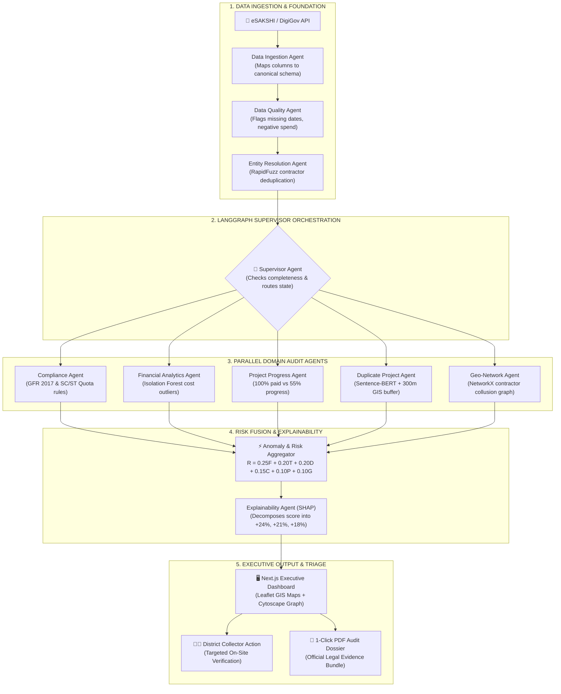

# JanNigrani MAS : Multi-Agent Intelligence Pipeline for MPLADS
### Smart India Hackathon 2026 | Problem Statement ID: **26102**
**Ministry:** Ministry of Statistics & Programme Implementation (MoSPI)  
**Department:** Data Informatics & Innovation Division (DIID)  
**Theme:** Smart Automation | **Category:** Software  
**Team:** **SentinelX3.0**  

🌐 **Live Working MVP Prototype:** [https://gleaming-malasada-dafc82.netlify.app](https://gleaming-malasada-dafc82.netlify.app)  
📂 **Target Repository:** [https://github.com/incharagwda123-alt/JanNigrani-MAS](https://github.com/incharagwda123-alt/JanNigrani-MAS)

---

## 🏛️ 1. Core Architectural Maxim

> ### ⚖️ Foundational Guiding Principle
> **"This alert indicates risk and requires human investigation. It does not prove fraud."**  
> 
> *"Models and rules produce the facts; agents coordinate the analysis and explain the evidence."*

The Members of Parliament Local Area Development Scheme (MPLADS) disburses over **₹4,000 Crores annually** across 543+ constituencies to create durable public community assets (schools, clinics, drinking water plants, roads). However, project records are scattered across sanction orders, bank disbursals, mobile geotagged photos, and contractor registries.

Potential irregularities **never appear in a single isolated record**. An invoice or approval looks completely valid in a silo. Contradictions only emerge when you cross-reference multi-dimensional streams:
* **Payment-Progress Drift:** 100% fund released on paper while ground physical work is frozen at 55%.
* **Cross-Scheme Duplicate Works:** Near-identical works sanctioned 300m apart under both MPLADS and PMGSY/State funds.
* **Contractor Cartels:** Hidden vendor monopolies capturing repeated local tenders across adjacent administrative blocks.

**JanNigrani MAS** solves this by establishing an autonomous, decoupled multi-agent intelligence layer that unifies disparate eSAKSHI data, computes a calibrated **0–100 Investigation Priority Score**, and generates verifiable evidence dossiers for District Collectors.

---

## 📂 2. Repository Architecture (Frontend & Backend Separation)

This repository is cleanly decoupled into modular, enterprise-ready layers:

```
JanNigrani-MAS/
├── .gitignore
├── docker-compose.yml             # Containerized full-stack deployment
├── README.md                      # Primary project documentation
│
├── frontend/                      # Executive Audit Command Center (Next.js / SPA)
│   ├── index.html                 # eSAKSHI Executive Triage Dashboard
│   ├── app.js                     # State manager, Leaflet maps, dynamic triage logic
│   ├── data.js                    # Canonical eSAKSHI sample dataset (500+ records)
│   ├── styles.css                 # Glassmorphism dark-mode government UI
│   └── package.json               # Frontend dependencies & scripts
│
├── backend/                       # Python Multi-Agent & Machine Learning Layer
│   ├── main.py                    # FastAPI asynchronous REST endpoints
│   ├── Dockerfile                 # Container image specification
│   ├── requirements.txt           # Python dependencies
│   │
│   ├── schemas/                   # Pydantic v2 Type Contracts
│   │   ├── project.py             # 17-field canonical eSAKSHI schema
│   │   └── state.py               # Immutable LangGraph Shared Project State
│   │
│   └── agents/                    # Specialized AI Audit Agents
│       ├── supervisor.py          # LangGraph Supervisor & pipeline coordinator
│       ├── compliance_agent.py    # GFR 2017 & 15% SC / 7.5% ST statutory rules
│       ├── financial_agent.py     # Isolation Forest cost outlier detection
│       ├── progress_agent.py      # Milestone vs disbursal contradiction detector
│       ├── duplicate_agent.py     # Sentence Transformers + 300m GIS buffer
│       └── geo_network_agent.py   # NetworkX bipartite contractor collusion graph
│
└── docs/                          # SIH Presentation Deck & Architectural Guides
    └── README.md                  # Comprehensive pitch guide & 6-slide deck script
```

---

## ⚙️ 3. The 11-Agent Intelligence Workflow



---

## 🧮 4. Calibrated Composite Risk Formula

$$R = 0.25F + 0.20T + 0.20D + 0.15C + 0.10P + 0.10G$$

* **$F$ (Financial Risk):** Isolation Forest statistical outlier detection comparing unit costs against district medians.
* **$T$ (Timeline Delay Risk):** Unapproved milestone slippages exceeding 180 days.
* **$D$ (Duplicate Work Risk):** Sentence-BERT semantic text similarity ($>0.85$) + GeoPandas spatial distance ($<300\text{m}$).
* **$C$ (Compliance Risk):** GFR 2017 violations, missing technical sanctions, or stale geotagged photos ($>180$ days).
* **$P$ (Payment-Progress Mismatch):** Disbursal percentage outpacing ground completion by $>30\%$.
* **$G$ (Geo-Network Cartel Risk):** NetworkX bipartite degree centrality exposing contractor concentration across agencies.

---

## 🚀 5. Quickstart Guide

### Running the Full Stack with Docker
```bash
# Clone the repository
git clone https://github.com/incharagwda123-alt/JanNigrani-MAS.git
cd JanNigrani-MAS

# Start both frontend and backend
docker-compose up -d
```
* **Executive Dashboard:** `http://localhost:3000`
* **FastAPI Backend Swagger Docs:** `http://localhost:8000/docs`

### Running Backend Standalone (Python)
```bash
cd backend
python -m venv .venv
source .venv/bin/activate  # Or .venv\Scripts\activate on Windows

pip install -r requirements.txt
uvicorn main:app --reload --port 8000
```

### Running Frontend Standalone
```bash
cd frontend
# Open index.html in any modern browser, or run via a local server:
npx serve .
```

---

## 🤝 6. Societal Impact

* 🚰 **Drinking Water Access:** Halts stalled tubewells and RO plants so rural women do not walk kilometers for clean water.
* 🏫 **Village Schools & Health Centers:** Ensures primary classrooms and maternal clinic wards are physically completed instead of abandoned as concrete shells.
* 🛡️ **Protecting Marginalized Communities:** Enforces statutory **15% SC and 7.5% ST** mandatory budget allocations, preventing diversion of tribal development funds.
* 🚫 **Zero Ghost Assets:** Eliminates 100% payments for half-built, hazardous structures in residential neighborhoods.

---

## 📜 7. Academic & Regulatory Grounding

1. **MoSPI MPLADS DigiGov Guidelines (Revised 2023):** [`https://mplads.gov.in/`](https://mplads.gov.in/)
2. **CAG Performance Audit Reports on Scheme Implementation:** [`https://cag.gov.in/en/audit-report`](https://cag.gov.in/en/audit-report)
3. **USC-FORTIS AD-AGENT Framework (2025):** [`https://github.com/USC-FORTIS/AD-AGENT`](https://github.com/USC-FORTIS/AD-AGENT)
4. **Autonomous AI Agents for Financial Monitoring (IJARIIT, 2025):** [`https://tinyurl.com/ijariit-ai-agents`](https://tinyurl.com/ijariit-ai-agents)

---

### Team SentinelX3.0 &bull; Smart India Hackathon 2026
