# JanNigrani MAS : Multi-Agent Intelligence Pipeline for MPLADS
### Smart India Hackathon 2026 | Problem Statement ID: **26102**
**Ministry:** Ministry of Statistics & Programme Implementation (MoSPI)  
**Department:** Data Informatics & Innovation Division (DIID)  
**Theme:** Smart Automation | **Category:** Software  
**Team:** **SentinelX3.0**  

🌐 **Live Working MVP Prototype:** [https://gleaming-malasada-dafc82.netlify.app](https://gleaming-malasada-dafc82.netlify.app)  
📂 **Target Repository:** [https://github.com/incharagwda123-alt/JanNigrani-MAS](https://github.com/incharagwda123-alt/JanNigrani-MAS)

---

## 🏛️ 1. Core Architectural Maxim

> ### ⚖️ Foundational Guiding Principle
> **"This alert indicates risk and requires human investigation. It does not prove fraud."**  
> 
> *"Models and rules produce the facts; agents coordinate the analysis and explain the evidence."*

The Members of Parliament Local Area Development Scheme (MPLADS) disburses over **₹4,000 Crores annually** across 543+ constituencies to create durable public community assets.

**JanNigrani MAS** establishes an autonomous, explainable multi-agent intelligence layer that unifies disparate eSAKSHI data, computes a calibrated **0–100 Investigation Priority Score**, and generates verifiable evidence dossiers for District Collectors.

---

## 🤖 2. The 4-Agent MVP System Architecture

For our buildable, production-ready MVP, the intelligence pipeline is structured around **4 Specialized Core Agents** coordinated by the LangGraph Supervisor:

```mermaid
flowchart TD
    subgraph S1["1. DATA INGESTION &amp; ENTITY RESOLUTION AGENT"]
        A["📡 eSAKSHI Data Ingestion"] --> B["Data Quality Sanitization<br/>(Flags negative spend &amp; missing IDs)"]
        B --> C["RapidFuzz Entity Resolution<br/>(Normalizes disguised vendor names)"]
    end

    subgraph S2["2. FINANCIAL &amp; PROGRESS ANOMALY AGENT"]
        C --> D["Payment-Progress Mismatch<br/>(100% funds released vs 55% progress)"]
        D --> E["Isolation Forest Cost Outlier<br/>(+40% above district median cost)"]
        E --> F["Statutory Compliance Check<br/>(GFR 2017 &amp; 15% SC / 7.5% ST Quotas)"]
    end

    subgraph S3["3. GEO-SPATIAL &amp; DUPLICATE WORK AGENT"]
        F --> G["Sentence Transformers Embeddings<br/>(Semantic project scope similarity)"]
        G --> H["GeoPandas 300m Radius Buffer<br/>(Cross-scheme duplicate funding)"]
        H --> I["NetworkX Bipartite Graph<br/>(Contractor cartel &amp; tender concentration)"]
    end

    subgraph S4["4. RISK SCORING &amp; EXPLAINABILITY AGENT (SHAP)"]
        I --> J["Calibrated Risk Aggregator<br/>R = 0.25F + 0.20T + 0.20D + 0.15C + 0.10P + 0.10G"]
        J --> K["SHAP Factor Decomposition<br/>(+24%, +21%, +18%, +14%, +9%)"]
        K --> L["1-Page Verifiable Evidence Dossier<br/>(Sanction PDF, PFMS Log, EXIF Geotag)"]
    end

    subgraph S5["5. ACTIONABLE HUMAN REVIEW"]
        L --> M["🖥️ District Collector Triage Queue"]
        M --> N["🧑‍💼 Targeted Physical Verification"]
    end

    classDef blueBox fill:#0f172a,stroke:#38bdf8,stroke-width:1.5px,color:#fff;
    classDef purpleBox fill:#1e1b4b,stroke:#818cf8,stroke-width:1.5px,color:#fff;
    classDef amberBox fill:#451a03,stroke:#f59e0b,stroke-width:1.5px,color:#fff;
    classDef greenBox fill:#064e3b,stroke:#10b981,stroke-width:1.5px,color:#fff;

    class A,B,C blueBox;
    class D,E,F purpleBox;
    class G,H,I amberBox;
    class J,K,L greenBox;
```



### Breakdown of the 4 MVP Agents:

1. **Agent 1: Data Ingestion & Quality Agent**
   * Standardizes eSAKSHI columns to a 17-field canonical schema.
   * Performs basic data sanity checks (*separating bad formatting from fraud*).
   * RapidFuzz entity matching unmasks disguised contractors (*"ABC Infra"* vs *"ABC Infrastructure"*).

2. **Agent 2: Financial & Progress Anomaly Agent**
   * Flags payment-progress contradictions (e.g., 100% money released while physical progress sits at 55%).
   * Uses **Isolation Forest** to catch abnormal cost estimates per unit work against district medians.
   * Enforces mandatory GFR 2017 rules and statutory **15% SC / 7.5% ST** quota compliance.

3. **Agent 3: Geo-Spatial & Duplicate Work Agent**
   * Uses **Sentence Transformers** to identify identical scopes disguised by varied wording.
   * Executes **GeoPandas 300-meter radius spatial buffering** to stop cross-scheme double-dipping.
   * Employs **NetworkX** to map contractor-agency collusion rings.

4. **Agent 4: Risk Scoring & Explainability Agent (SHAP)**
   * Synthesizes the calibrated composite formula:
     $$R = 0.25F + 0.20T + 0.20D + 0.15C + 0.10P + 0.10G$$
   * Generates SHAP mathematical feature weights (`+24%`, `+21%`, `+18%`).
   * Bundles clickable source links (Sanction Order, PFMS Disbursal, EXIF Geotag) for human verification.

---

## 📂 3. Repository Structure

```
JanNigrani-MAS/
├── .gitignore
├── docker-compose.yml             # Containerized full-stack deployment
├── README.md                      # Primary project documentation
│
├── frontend/                      # Executive Audit Command Center (Next.js / SPA)
│   ├── index.html                 # eSAKSHI Executive Triage Dashboard
│   ├── app.js                     # State manager, Leaflet maps, dynamic triage logic
│   ├── data.js                    # Canonical eSAKSHI sample dataset (500+ records)
│   ├── styles.css                 # Glassmorphism dark-mode government UI
│   └── package.json               # Frontend dependencies & scripts
│
├── backend/                       # Python 4-Agent MVP & Machine Learning Layer
│   ├── main.py                    # FastAPI asynchronous REST endpoints
│   ├── Dockerfile                 # Container image specification
│   ├── requirements.txt           # Python dependencies
│   │
│   ├── schemas/                   # Pydantic v2 Type Contracts
│   │   ├── project.py             # 17-field canonical eSAKSHI schema
│   │   └── state.py               # Immutable LangGraph Shared Project State
│   │
│   └── agents/                    # The 4 Core MVP Agents
│       ├── supervisor.py          # 4-Agent MVP Pipeline Coordinator
│       └── __init__.py
│
└── docs/                          # SIH Presentation Deck & Architectural Guides
    └── README.md                  # Comprehensive pitch guide & 6-slide deck script
```

---

## 🚀 4. Quickstart Guide

### Running the Full Stack with Docker
```bash
git clone https://github.com/incharagwda123-alt/JanNigrani-MAS.git
cd JanNigrani-MAS
docker-compose up -d
```
* **Executive Dashboard:** `http://localhost:3000`
* **FastAPI Backend Docs:** `http://localhost:8000/docs`

### Running Backend Standalone (Python)
```bash
cd backend
python -m venv .venv
source .venv/bin/activate  # Or .venv\Scripts\activate on Windows
pip install -r requirements.txt
uvicorn main:app --reload --port 8000
```

### Running Frontend Standalone
```bash
cd frontend
npx serve .
```

---

## 🤝 5. Societal Impact

* 🚰 **Clean Drinking Water:** Halts stalled tubewells & RO plants; ensures rural families don't walk kilometers for water.
* 🏫 **Village Schools & Health Centers:** Guarantees primary school classrooms and maternal clinic wards are physically completed instead of abandoned.
* 🛡️ **Protecting Marginalized Communities:** Enforces statutory **15% SC and 7.5% ST** mandatory budget allocations, preventing diversion of tribal development funds.
* 🚫 **Zero Ghost Assets:** Eliminates 100% payouts for half-built, hazardous structures in residential neighborhoods.

---

### Team SentinelX3.0 &bull; Smart India Hackathon 2026
